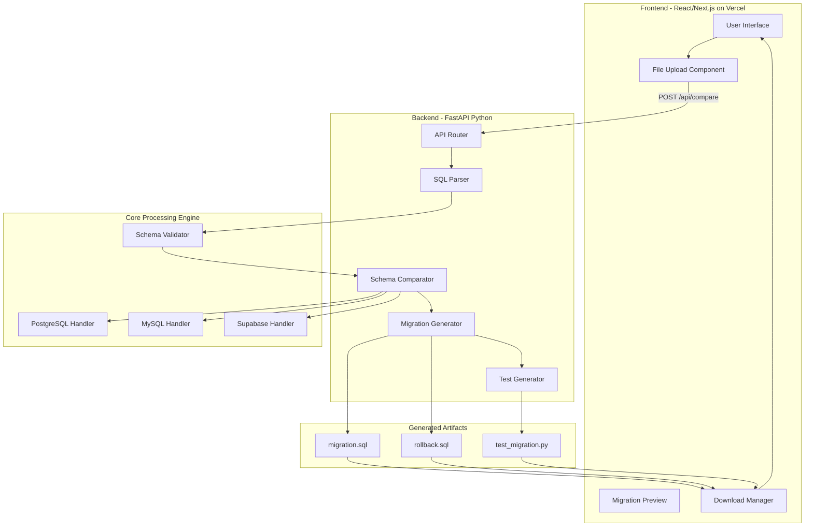
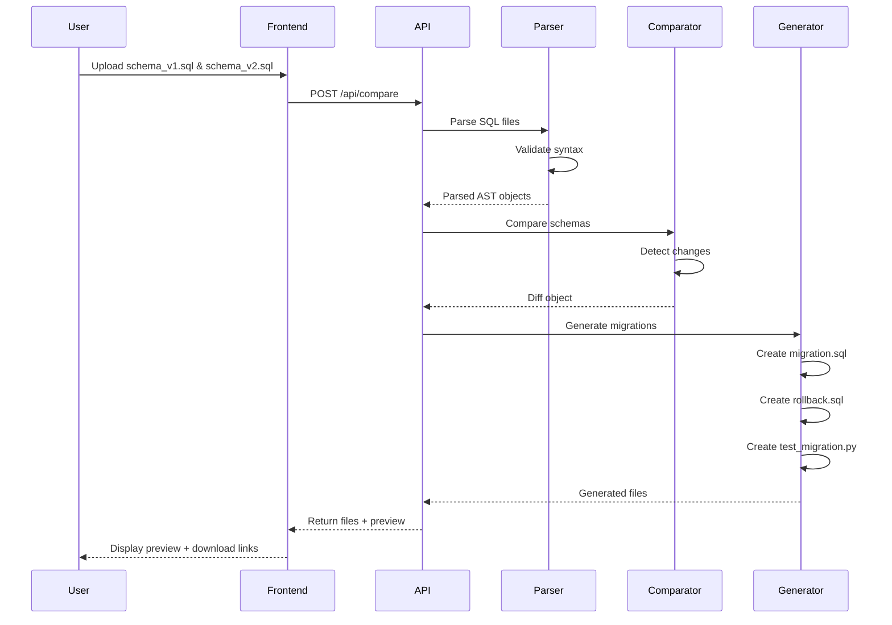

# Suturé - Phase 1 Plan
**SQL Schema Migration Tool**

## Project Overview
- **Name**: Suturé
- **Objective**: Compare two SQL schemas and generate migration.sql + rollback.sql + comprehensive tests
- **Problem**: ~48% of developers struggle with cloud resources and DB change management (slow and manual)
- **Target Users**: DevOps engineers, Database administrators, Backend developers

## Architecture Stack

### Frontend
- **Framework**: React (Next.js recommended for Vercel deployment)
- **UI Library**: Tailwind CSS + shadcn/ui components
- **Deployment**: Vercel
- **Features**: File upload, schema comparison visualization, download generated files

### Backend
- **Language**: Python 3.13
- **Framework**: FastAPI (for REST API)
- **Core Libraries**:
  - `sqlparse` - SQL parsing and formatting
  - `SQLAlchemy` - Database abstraction and schema introspection
  - `alembic` - Migration generation patterns
  - `pytest` - Test generation and validation
- **Database Support**: Supabase, PostgreSQL, MySQL

### Infrastructure
- **Containerization**: Docker + Docker Compose
- **API Communication**: REST API (JSON)
- **File Storage**: Temporary file handling for uploads/downloads

## Complete Folder Structure

```
suture/
├── .gitignore
├── .env.example
├── README.md
├── PHASE1_PLAN.md
├── docker-compose.yml
├── Dockerfile
│
├── client/                          # React Frontend
│   ├── .env.local.example
│   ├── .eslintrc.json
│   ├── .gitignore
│   ├── next.config.js
│   ├── package.json
│   ├── postcss.config.js
│   ├── tailwind.config.js
│   ├── tsconfig.json
│   ├── public/
│   │   ├── favicon.ico
│   │   └── logo.svg
│   ├── src/
│   │   ├── app/
│   │   │   ├── layout.tsx
│   │   │   ├── page.tsx
│   │   │   └── globals.css
│   │   ├── components/
│   │   │   ├── ui/                  # shadcn/ui components
│   │   │   │   ├── button.tsx
│   │   │   │   ├── card.tsx
│   │   │   │   ├── input.tsx
│   │   │   │   └── toast.tsx
│   │   │   ├── FileUpload.tsx
│   │   │   ├── SchemaComparison.tsx
│   │   │   ├── MigrationPreview.tsx
│   │   │   └── DownloadButtons.tsx
│   │   ├── lib/
│   │   │   ├── api.ts               # API client
│   │   │   └── utils.ts
│   │   └── types/
│   │       └── schema.ts
│   └── vercel.json
│
├── server/                          # Python Backend
│   ├── .env.example
│   ├── requirements.txt
│   ├── requirements-dev.txt
│   ├── setup.py
│   ├── pytest.ini
│   ├── .flake8
│   ├── pyproject.toml
│   │
│   ├── app/
│   │   ├── __init__.py
│   │   ├── main.py                  # FastAPI application entry
│   │   ├── config.py                # Configuration management
│   │   │
│   │   ├── api/
│   │   │   ├── __init__.py
│   │   │   ├── routes.py            # API endpoints
│   │   │   └── schemas.py           # Pydantic models
│   │   │
│   │   ├── core/
│   │   │   ├── __init__.py
│   │   │   ├── parser.py            # SQL parsing logic
│   │   │   ├── comparator.py        # Schema comparison engine
│   │   │   ├── generator.py         # Migration/rollback generator
│   │   │   └── validator.py         # Schema validation
│   │   │
│   │   ├── database/
│   │   │   ├── __init__.py
│   │   │   ├── models.py            # SQLAlchemy models
│   │   │   ├── postgresql.py        # PostgreSQL-specific logic
│   │   │   ├── mysql.py             # MySQL-specific logic
│   │   │   └── supabase.py          # Supabase integration
│   │   │
│   │   ├── tests/
│   │   │   ├── __init__.py
│   │   │   ├── generator.py         # Test file generator
│   │   │   └── templates.py         # Test templates
│   │   │
│   │   └── utils/
│   │       ├── __init__.py
│   │       ├── file_handler.py      # File upload/download
│   │       ├── logger.py            # Logging configuration
│   │       └── exceptions.py        # Custom exceptions
│   │
│   └── tests/                       # Backend tests
│       ├── __init__.py
│       ├── conftest.py
│       ├── test_parser.py
│       ├── test_comparator.py
│       ├── test_generator.py
│       └── fixtures/
│           ├── schema_v1.sql
│           └── schema_v2.sql
│
├── docs/                            # Documentation
│   ├── API.md
│   ├── ARCHITECTURE.md
│   └── EXAMPLES.md
│
└── examples/                        # Example schemas
    ├── simple/
    │   ├── schema_v1.sql
    │   └── schema_v2.sql
    └── complex/
        ├── schema_v1.sql
        └── schema_v2.sql
```

## Dependency List

### Backend (requirements.txt)
```txt
# Core Framework
fastapi==0.109.0
uvicorn[standard]==0.27.0
python-multipart==0.0.6

# Database & SQL
sqlparse==0.4.4
SQLAlchemy==2.0.25
psycopg2-binary==2.9.9
PyMySQL==1.1.0
alembic==1.13.1

# Supabase
supabase==2.3.4

# Validation & Serialization
pydantic==2.5.3
pydantic-settings==2.1.0

# Testing
pytest==7.4.4
pytest-asyncio==0.23.3
pytest-cov==4.1.0

# Utilities
python-dotenv==1.0.0
loguru==0.7.2
```

### Backend Dev Dependencies (requirements-dev.txt)
```txt
black==24.1.1
flake8==7.0.0
mypy==1.8.0
isort==5.13.2
pre-commit==3.6.0
```

### Frontend (package.json dependencies)
```json
{
  "dependencies": {
    "next": "^14.1.0",
    "react": "^18.2.0",
    "react-dom": "^18.2.0",
    "tailwindcss": "^3.4.1",
    "axios": "^1.6.5",
    "lucide-react": "^0.312.0",
    "class-variance-authority": "^0.7.0",
    "clsx": "^2.1.0",
    "tailwind-merge": "^2.2.0"
  },
  "devDependencies": {
    "@types/node": "^20.11.5",
    "@types/react": "^18.2.48",
    "@types/react-dom": "^18.2.18",
    "typescript": "^5.3.3",
    "eslint": "^8.56.0",
    "eslint-config-next": "^14.1.0",
    "autoprefixer": "^10.4.17",
    "postcss": "^8.4.33"
  }
}
```

## Architecture Diagram



## Core Workflow



## API Endpoints

### POST /api/compare
**Request:**
```json
{
  "schema_v1": "file content or base64",
  "schema_v2": "file content or base64",
  "database_type": "postgresql|mysql|supabase",
  "options": {
    "include_tests": true,
    "test_coverage": "comprehensive",
    "migration_style": "alembic|raw"
  }
}
```

**Response:**
```json
{
  "status": "success",
  "comparison": {
    "added_tables": [],
    "dropped_tables": [],
    "modified_tables": [],
    "added_columns": {},
    "dropped_columns": {},
    "modified_columns": {},
    "added_indexes": [],
    "dropped_indexes": []
  },
  "files": {
    "migration": "base64_content",
    "rollback": "base64_content",
    "tests": "base64_content"
  },
  "preview": {
    "migration_sql": "string",
    "rollback_sql": "string",
    "test_count": 15
  }
}
```

## Risks and Mitigation Strategies

### Technical Risks

| Risk | Impact | Probability | Mitigation Strategy |
|------|--------|-------------|---------------------|
| **SQL Dialect Differences** | High | High | Create database-specific handlers with comprehensive test coverage for each dialect |
| **Complex Schema Changes** | High | Medium | Implement incremental parsing with detailed error messages and validation |
| **File Size Limitations** | Medium | Medium | Implement streaming for large files, set reasonable limits (10MB), add compression |
| **Parsing Ambiguities** | High | Medium | Use sqlparse + custom validation layer, maintain test fixtures for edge cases |
| **Test Generation Accuracy** | High | Medium | Create template-based test generation with configurable coverage levels |

### Operational Risks

| Risk | Impact | Probability | Mitigation Strategy |
|------|--------|-------------|---------------------|
| **API Rate Limiting** | Medium | Low | Implement request throttling, caching for repeated comparisons |
| **Deployment Issues** | Medium | Low | Use Docker for consistent environments, CI/CD with automated testing |
| **Data Privacy** | High | Medium | No persistent storage of uploaded schemas, clear data retention policy |
| **Concurrent Requests** | Medium | Medium | Implement async processing with FastAPI, use worker pools |

### Business Risks

| Risk | Impact | Probability | Mitigation Strategy |
|------|--------|-------------|---------------------|
| **User Adoption** | High | Medium | Focus on UX, provide clear examples, comprehensive documentation |
| **Competitor Features** | Medium | Medium | Prioritize unique features (comprehensive tests, multi-DB support) |
| **Maintenance Burden** | Medium | High | Modular architecture, comprehensive test coverage, clear documentation |

## Phase 1 Deliverables

### 1. Complete Folder Structure ✓
- Organized client/server separation
- Clear module boundaries
- Scalable architecture

### 2. Dependency List ✓
- Backend: FastAPI + SQLAlchemy + sqlparse + pytest
- Frontend: Next.js + React + Tailwind CSS
- All versions specified for reproducibility

### 3. Architecture Diagram ✓
- System architecture (Mermaid)
- Workflow sequence diagram
- Clear component relationships

### 4. Risks and Mitigation ✓
- Technical, operational, and business risks identified
- Mitigation strategies for each risk
- Impact and probability assessment

## Next Steps (Phase 2)

1. **Environment Setup**
   - Initialize Git repository
   - Set up Docker containers
   - Configure development environment

2. **Backend Core Development**
   - Implement SQL parser
   - Build schema comparator
   - Create migration generator

3. **Frontend Development**
   - Set up Next.js project
   - Build file upload interface
   - Create preview components

4. **Integration & Testing**
   - Connect frontend to backend API
   - Write comprehensive tests
   - Validate with example schemas

## Success Metrics

- **Parsing Accuracy**: 95%+ for common SQL patterns
- **Test Coverage**: 80%+ code coverage
- **Performance**: Process schemas up to 5MB in <5 seconds
- **User Experience**: Upload to download in <10 seconds
- **Database Support**: PostgreSQL, MySQL, Supabase fully supported

## Timeline Estimate

- **Phase 1 (Planning)**: 30 minutes ✓
- **Phase 2 (Setup)**: 1 hour
- **Phase 3 (Backend Core)**: 4-6 hours
- **Phase 4 (Frontend)**: 3-4 hours
- **Phase 5 (Integration)**: 2-3 hours
- **Phase 6 (Testing)**: 2-3 hours

**Total Estimated Time**: 12-17 hours

## Notes

- Focus on PostgreSQL first, then expand to MySQL and Supabase
- Prioritize common schema changes (tables, columns, indexes)
- Keep UI simple and intuitive
- Ensure generated migrations are production-ready
- Include comprehensive test generation from day one