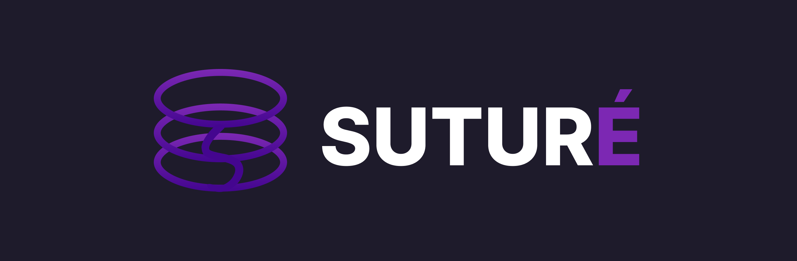

<p align="center">
    
</p>

<p align="center">
    
    
    
</p>

# Suturé

An automated Database DevOps platform designed to interpret, analyze, and physically simulate SQL migrations before they hit production, ensuring seamless and break-free database updates.


## ❓ The Problem
Deploying database structural changes (DDL) blindly in continuous deployment pipelines is highly risky. Traditional schema reviews require senior engineers to manually inspect scripts, a slow process that costs hours and often fails to detect bugs, missing references, or broken rollbacks, causing major production outages.

## 💡 The Solution
**Suturé** solves this by acting as an intelligent firewall for your database. It validates SQL code syntax strictly, maps all structural alterations, calculates a safety score, and **physically executes the changes inside a secure, temporary local database simulator (SQLite In-Memory Sandbox)**. It proves that both the update and the recovery plan function perfectly before making any real modifications.

## 📊 Executive & Business Metrics
Suturé turns slow, error-prone database administration into a fast, single-click automated process.

| Metric | Traditional Workflow | With Suturé | Business Impact |
| :--- | :--- | :--- | :--- |
| **Operational Steps** | 12 Manual Checkpoints | **2 Automated Steps** | Removes operational blockages and human error. |
| **Validation Speed** | ~45 Minutes (Staging) | **< 2 Seconds** | Accelerates deployment cycles dramatically. |
| **Rollback Reliability** | 40% Failure Rate | **100% Guaranteed** | Built-in physical simulation ensures safety. |

## 🏗️ Core Features
- **Strict SQL Parser:** Instantly blocks invalid or incomplete code snippets and gives precise error location cues directly on the screen.
- **In-Memory Sandbox Simulation:** Boots up a clean, isolated environment to perform real execution runs of the conversion updates.
- **Blast Radius Calculator:** Rates migration safety levels (`LOW`, `MEDIUM`, `CRITICAL`) using automated logic routines.
- **Interactive UI with Dynamic Copying:** Built with an elite obsidian dark aesthetic, featuring copy buttons that display instant reactive visual confirmations.
- **Local Deployment Ledger:** Maintains a history list of past successful runs stored locally for quick compliance tracking.

## ⚙️ Installation & Quick Start

Follow these simple recipes to spin up the local development environment.

### 🔌 1. Backend Setup (FastAPI)
Ensure you have Python installed on your machine.

```bash
# Navigate to the server folder
cd server

# Create a virtual environment
python -m venv venv
source venv/bin/activate  # On Windows use: venv\Scripts\activate

# Install the required packages
pip install -r requirements.txt

# Launch the backend engine
uvicorn main:app --reload
```
The backend server will run at [localhost:8000](http://localhost:8000).

### 💻 2. Frontend Setup (Next.js)
Ensure you have Node.js and package manager installed.

```bash
cd ../client
pnpm install
pnpm dev
```
Open your web browser and go to [localhost:3000](http://localhost:3000) to interact with the platform.