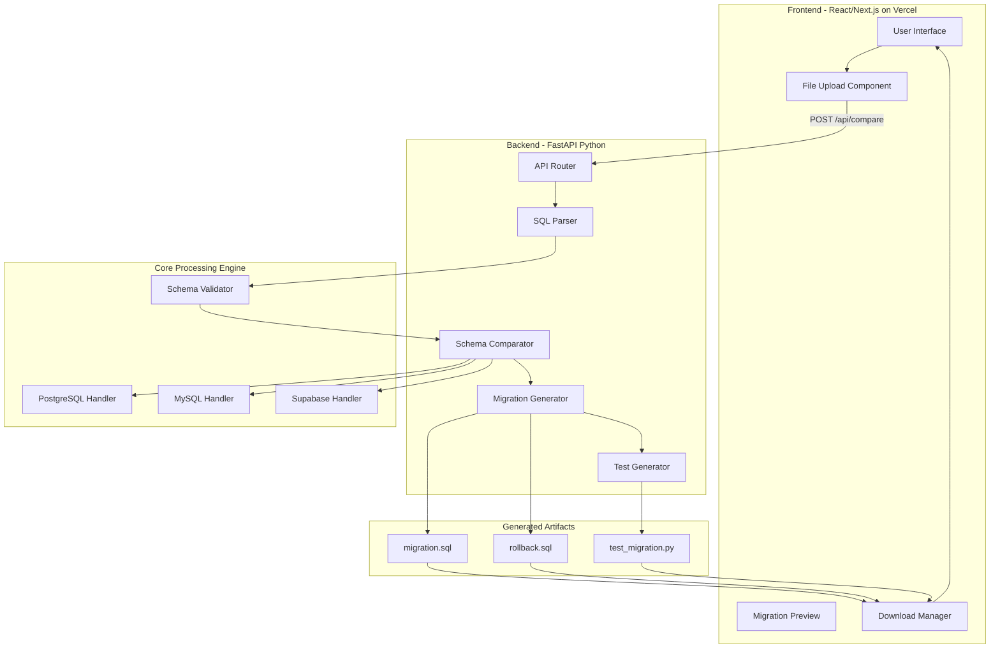
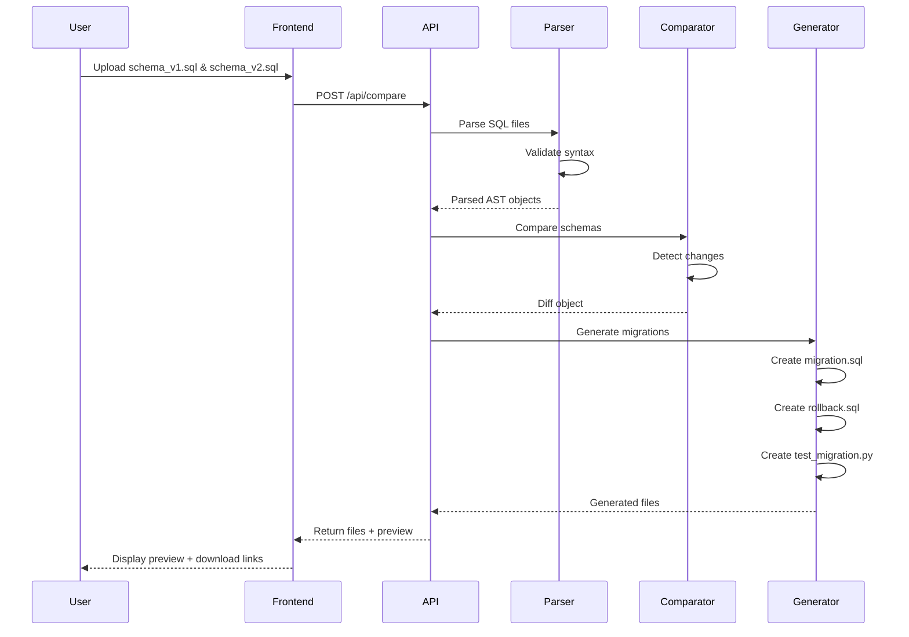

**User:**

<task>
# Role and Context
Your task is to plan and execute suggestions for the next project below.

## Project Context

- Name: **Suturé**
- Objective: Tool that compares two SQL schemas and generates migration.sql + rollback.sql + tests
- Problem: around ~48% of devs are dealing with cloud resources, DB change management (slow and manual)
- **User input:** 2 SQL files (schema_v1.sql = before, schema_v2.sql = after)
- **Output:** migration.sql + rollback.sql + test_migration.py
- **Stack:** Python 3.13 + sqlparse + SQLAlchemy + pytest + Streamlit + Docker

### PHASE 1: PLAN (30 min)
Generates:
- [ ] Complete folder structure
- [ ] Dependency list (requirements.txt)
- [ ] Architecture diagram (Mermaid ASCII)
- [ ] Risks and mitigation
</task>
<environment_details>
# VSCode Visible Files
.gitignore

# VSCode Open Tabs
.gitignore

# Current Time
Current time in ISO 8601 UTC format: 2026-05-15T16:29:13.365Z
User time zone: America/Tegucigalpa, UTC-6:00

# Current Cost
$0.00

# Review Exclusions
The following file patterns are excluded from code reviews:
- .vscode/**

# Current Mode
<slug>plan</slug>
<name>📝 Plan</name>


# Current Workspace Directory (/home/djacoz/projects/fullstack/suture) Files
.gitignore
bob_sessions/
client/
server/
You have not created a todo list yet. Create one with `update_todo_list` if your task is complicated or involves multiple steps.
</environment_details>

---

**Assistant:**

I'll help you plan and execute Phase 1 for the Suturé project. Let me start by gathering information about the current project structure and then create a comprehensive plan.

<read_file>
<args>
  <file>
    <path>.gitignore</path>
  </file>
</args>
</read_file>

---

**User:**

[read_file for '.gitignore'. Reading multiple files at once is more efficient for the LLM. If other files are relevant to your current task, please read them simultaneously.] Result:
<files>
<file><path>.gitignore</path>
<content lines="1-1">
1 | **/.env
</content>
</file>
</files>
<environment_details>
# VSCode Visible Files
.gitignore

# VSCode Open Tabs
.gitignore

# Current Time
Current time in ISO 8601 UTC format: 2026-05-15T16:31:46.434Z
User time zone: America/Tegucigalpa, UTC-6:00

# Current Cost
$0.03

# Review Exclusions
The following file patterns are excluded from code reviews:
- .vscode/**

# Current Mode
<slug>plan</slug>
<name>📝 Plan</name>
You have not created a todo list yet. Create one with `update_todo_list` if your task is complicated or involves multiple steps.
</environment_details>

---

**Assistant:**

<list_files>
<args>
<path>.</path>
<recursive>true</recursive>
</args>
</list_files>

---

**User:**

[list_files for 'undefined'] Result:
The tool execution failed with the following error:
<error>
Missing value for required parameter 'path'. Please retry with complete response.

# Reminder: Instructions for Tool Use

Tool uses are formatted using XML-style tags. The tool name itself becomes the XML tag name. Each parameter is enclosed within its own set of tags. Here's the structure:

<actual_tool_name>
<parameter1_name>value1</parameter1_name>
<parameter2_name>value2</parameter2_name>
...
</actual_tool_name>

For example, to use the attempt_completion tool:

<attempt_completion>
<result>
I have completed the task...
</result>
</attempt_completion>

Always use the actual tool name as the XML tag name for proper parsing and execution.
</error>
<environment_details>
# VSCode Visible Files
.gitignore

# VSCode Open Tabs
.gitignore

# Current Time
Current time in ISO 8601 UTC format: 2026-05-15T16:31:51.207Z
User time zone: America/Tegucigalpa, UTC-6:00

# Current Cost
$0.06

# Review Exclusions
The following file patterns are excluded from code reviews:
- .vscode/**

# Current Mode
<slug>plan</slug>
<name>📝 Plan</name>
You have not created a todo list yet. Create one with `update_todo_list` if your task is complicated or involves multiple steps.
</environment_details>

---

**Assistant:**

<list_files>
<path>.</path>
<recursive>true</recursive>
</list_files>

---

**User:**

[list_files for '.'] Result:
.gitignore
bob_sessions/
client/
server/
<environment_details>
# VSCode Visible Files
.gitignore

# VSCode Open Tabs
.gitignore

# Current Time
Current time in ISO 8601 UTC format: 2026-05-15T16:37:09.403Z
User time zone: America/Tegucigalpa, UTC-6:00

# Current Cost
$0.09

# Review Exclusions
The following file patterns are excluded from code reviews:
- .vscode/**

# Current Mode
<slug>plan</slug>
<name>📝 Plan</name>
You have not created a todo list yet. Create one with `update_todo_list` if your task is complicated or involves multiple steps.
</environment_details>

---

**Assistant:**

<list_files>
<path>client</path>
<recursive>true</recursive>
</list_files>

---

**User:**

[list_files for 'client'] Result:
No files found.
<environment_details>
# VSCode Visible Files
.gitignore

# VSCode Open Tabs
.gitignore

# Current Time
Current time in ISO 8601 UTC format: 2026-05-15T16:37:58.838Z
User time zone: America/Tegucigalpa, UTC-6:00

# Current Cost
$0.12

# Review Exclusions
The following file patterns are excluded from code reviews:
- .vscode/**

# Current Mode
<slug>plan</slug>
<name>📝 Plan</name>
You have not created a todo list yet. Create one with `update_todo_list` if your task is complicated or involves multiple steps.
</environment_details>

---

**Assistant:**

<list_files>
<path>server</path>
<recursive>true</recursive>
</list_files>

---

**User:**

[list_files for 'server'] Result:
No files found.
<environment_details>
# VSCode Visible Files
.gitignore

# VSCode Open Tabs
.gitignore

# Current Time
Current time in ISO 8601 UTC format: 2026-05-15T16:38:03.095Z
User time zone: America/Tegucigalpa, UTC-6:00

# Current Cost
$0.15

# Review Exclusions
The following file patterns are excluded from code reviews:
- .vscode/**

# Current Mode
<slug>plan</slug>
<name>📝 Plan</name>
You have not created a todo list yet. Create one with `update_todo_list` if your task is complicated or involves multiple steps.
</environment_details>

---

**Assistant:**

Now I have a good understanding of the current project state. The project is essentially empty with just a `.gitignore` file and empty `client/` and `server/` directories. Let me create a comprehensive Phase 1 plan for the Suturé project.

<update_todo_list>
<todos>
[-] Analyze project requirements and create initial planning documents
[ ] Design complete folder structure for the project
[ ] Create dependency list (requirements.txt) with all necessary packages
[ ] Design architecture diagram using Mermaid
[ ] Identify risks and create mitigation strategies
[ ] Document the complete Phase 1 plan in markdown
[ ] Review plan with user for approval
</todos>
</update_todo_list>

---

**User:**

[update_todo_list] Result:
Todo list updated successfully.
<environment_details>
# VSCode Visible Files


# VSCode Open Tabs
.gitignore

# Current Time
Current time in ISO 8601 UTC format: 2026-05-15T16:38:38.599Z
User time zone: America/Tegucigalpa, UTC-6:00

# Current Cost
$0.19

# Review Exclusions
The following file patterns are excluded from code reviews:
- .vscode/**
- .env

# Current Mode
<slug>plan</slug>
<name>📝 Plan</name>
====

REMINDERS

Below is your current list of reminders for this task. Keep them updated as you progress.

| # | Content | Status |
|---|---------|--------|
| 1 | Analyze project requirements and create initial planning documents | In Progress |
| 2 | Design complete folder structure for the project | Pending |
| 3 | Create dependency list (requirements.txt) with all necessary packages | Pending |
| 4 | Design architecture diagram using Mermaid | Pending |
| 5 | Identify risks and create mitigation strategies | Pending |
| 6 | Document the complete Phase 1 plan in markdown | Pending |
| 7 | Review plan with user for approval | Pending |


IMPORTANT: When task status changes, remember to call the `update_todo_list` tool to update your progress.

</environment_details>

---

**Assistant:**

<ask_followup_question>
<question>Before I create the complete Phase 1 plan, I need to clarify a few architectural decisions for Suturé:

1. **Deployment Model**: Should this be a web application (Streamlit UI) or a CLI tool, or both?
2. **Database Support**: Which SQL databases should we support initially? (PostgreSQL, MySQL, SQLite, all of them?)
3. **Migration Strategy**: Should the tool support incremental migrations or just full schema comparisons?
4. **Test Generation**: What level of test coverage do you want? (Basic smoke tests, comprehensive validation, or data integrity tests?)</question>
<follow_up>
<suggest>Web app with Streamlit UI, support PostgreSQL + MySQL, full schema comparison, comprehensive validation tests</suggest>
<suggest>CLI tool + optional web UI, support all major SQL databases (PostgreSQL, MySQL, SQLite), incremental migrations, basic smoke tests</suggest>
<suggest>Web app only, PostgreSQL focus initially, full schema comparison, data integrity tests included</suggest>
<suggest>Both CLI and web UI, PostgreSQL + MySQL support, full schema comparison with optional incremental mode, comprehensive test suite</suggest>
</follow_up>
</ask_followup_question>

---

**User:**

[ask_followup_question for 'Before I create the complete Phase 1 plan, I need to clarify a few architectural decisions for Suturé:

1. **Deployment Model**: Should this be a web application (Streamlit UI) or a CLI tool, or both?
2. **Database Support**: Which SQL databases should we support initially? (PostgreSQL, MySQL, SQLite, all of them?)
3. **Migration Strategy**: Should the tool support incremental migrations or just full schema comparisons?
4. **Test Generation**: What level of test coverage do you want? (Basic smoke tests, comprehensive validation, or data integrity tests?)'] Result:
<answer>
Web app with Vercel(React framework), support Supabase, PostgreSQL + MySQL, full schema comparison, comprehensive validation tests.
</answer>
<environment_details>
# VSCode Visible Files


# VSCode Open Tabs
.gitignore

# Current Time
Current time in ISO 8601 UTC format: 2026-05-15T16:41:05.642Z
User time zone: America/Tegucigalpa, UTC-6:00

# Current Cost
$0.22

# Review Exclusions
The following file patterns are excluded from code reviews:
- .vscode/**
- .env

# Current Mode
<slug>plan</slug>
<name>📝 Plan</name>
====

REMINDERS

Below is your current list of reminders for this task. Keep them updated as you progress.

| # | Content | Status |
|---|---------|--------|
| 1 | Analyze project requirements and create initial planning documents | In Progress |
| 2 | Design complete folder structure for the project | Pending |
| 3 | Create dependency list (requirements.txt) with all necessary packages | Pending |
| 4 | Design architecture diagram using Mermaid | Pending |
| 5 | Identify risks and create mitigation strategies | Pending |
| 6 | Document the complete Phase 1 plan in markdown | Pending |
| 7 | Review plan with user for approval | Pending |


IMPORTANT: When task status changes, remember to call the `update_todo_list` tool to update your progress.

</environment_details>

---

**Assistant:**

Perfect! Now I understand the architecture better. Let me create a comprehensive Phase 1 plan with the updated stack: React frontend (Vercel deployment) + Python backend + Supabase/PostgreSQL/MySQL support.

<write_to_file>
<path>PHASE1_PLAN.md</path>
<content>
# Suturé - Phase 1 Plan
**SQL Schema Migration Tool**

## Project Overview
- **Name**: Suturé
- **Objective**: Compare two SQL schemas and generate migration.sql + rollback.sql + comprehensive tests
- **Problem**: ~48% of developers struggle with cloud resources and DB change management (slow and manual)
- **Target Users**: DevOps engineers, Database administrators, Backend developers

## Architecture Stack

### Frontend
- **Framework**: React (Next.js recommended for Vercel deployment)
- **UI Library**: Tailwind CSS + shadcn/ui components
- **Deployment**: Vercel
- **Features**: File upload, schema comparison visualization, download generated files

### Backend
- **Language**: Python 3.13
- **Framework**: FastAPI (for REST API)
- **Core Libraries**:
  - `sqlparse` - SQL parsing and formatting
  - `SQLAlchemy` - Database abstraction and schema introspection
  - `alembic` - Migration generation patterns
  - `pytest` - Test generation and validation
- **Database Support**: Supabase, PostgreSQL, MySQL

### Infrastructure
- **Containerization**: Docker + Docker Compose
- **API Communication**: REST API (JSON)
- **File Storage**: Temporary file handling for uploads/downloads

## Complete Folder Structure

```
suture/
├── .gitignore
├── .env.example
├── README.md
├── PHASE1_PLAN.md
├── docker-compose.yml
├── Dockerfile
│
├── client/                          # React Frontend
│   ├── .env.local.example
│   ├── .eslintrc.json
│   ├── .gitignore
│   ├── next.config.js
│   ├── package.json
│   ├── postcss.config.js
│   ├── tailwind.config.js
│   ├── tsconfig.json
│   ├── public/
│   │   ├── favicon.ico
│   │   └── logo.svg
│   ├── src/
│   │   ├── app/
│   │   │   ├── layout.tsx
│   │   │   ├── page.tsx
│   │   │   └── globals.css
│   │   ├── components/
│   │   │   ├── ui/                  # shadcn/ui components
│   │   │   │   ├── button.tsx
│   │   │   │   ├── card.tsx
│   │   │   │   ├── input.tsx
│   │   │   │   └── toast.tsx
│   │   │   ├── FileUpload.tsx
│   │   │   ├── SchemaComparison.tsx
│   │   │   ├── MigrationPreview.tsx
│   │   │   └── DownloadButtons.tsx
│   │   ├── lib/
│   │   │   ├── api.ts               # API client
│   │   │   └── utils.ts
│   │   └── types/
│   │       └── schema.ts
│   └── vercel.json
│
├── server/                          # Python Backend
│   ├── .env.example
│   ├── requirements.txt
│   ├── requirements-dev.txt
│   ├── setup.py
│   ├── pytest.ini
│   ├── .flake8
│   ├── pyproject.toml
│   │
│   ├── app/
│   │   ├── __init__.py
│   │   ├── main.py                  # FastAPI application entry
│   │   ├── config.py                # Configuration management
│   │   │
│   │   ├── api/
│   │   │   ├── __init__.py
│   │   │   ├── routes.py            # API endpoints
│   │   │   └── schemas.py           # Pydantic models
│   │   │
│   │   ├── core/
│   │   │   ├── __init__.py
│   │   │   ├── parser.py            # SQL parsing logic
│   │   │   ├── comparator.py        # Schema comparison engine
│   │   │   ├── generator.py         # Migration/rollback generator
│   │   │   └── validator.py         # Schema validation
│   │   │
│   │   ├── database/
│   │   │   ├── __init__.py
│   │   │   ├── models.py            # SQLAlchemy models
│   │   │   ├── postgresql.py        # PostgreSQL-specific logic
│   │   │   ├── mysql.py             # MySQL-specific logic
│   │   │   └── supabase.py          # Supabase integration
│   │   │
│   │   ├── tests/
│   │   │   ├── __init__.py
│   │   │   ├── generator.py         # Test file generator
│   │   │   └── templates.py         # Test templates
│   │   │
│   │   └── utils/
│   │       ├── __init__.py
│   │       ├── file_handler.py      # File upload/download
│   │       ├── logger.py            # Logging configuration
│   │       └── exceptions.py        # Custom exceptions
│   │
│   └── tests/                       # Backend tests
│       ├── __init__.py
│       ├── conftest.py
│       ├── test_parser.py
│       ├── test_comparator.py
│       ├── test_generator.py
│       └── fixtures/
│           ├── schema_v1.sql
│           └── schema_v2.sql
│
├── docs/                            # Documentation
│   ├── API.md
│   ├── ARCHITECTURE.md
│   └── EXAMPLES.md
│
└── examples/                        # Example schemas
    ├── simple/
    │   ├── schema_v1.sql
    │   └── schema_v2.sql
    └── complex/
        ├── schema_v1.sql
        └── schema_v2.sql
```

## Dependency List

### Backend (requirements.txt)
```txt
# Core Framework
fastapi==0.109.0
uvicorn[standard]==0.27.0
python-multipart==0.0.6

# Database & SQL
sqlparse==0.4.4
SQLAlchemy==2.0.25
psycopg2-binary==2.9.9
PyMySQL==1.1.0
alembic==1.13.1

# Supabase
supabase==2.3.4

# Validation & Serialization
pydantic==2.5.3
pydantic-settings==2.1.0

# Testing
pytest==7.4.4
pytest-asyncio==0.23.3
pytest-cov==4.1.0

# Utilities
python-dotenv==1.0.0
loguru==0.7.2
```

### Backend Dev Dependencies (requirements-dev.txt)
```txt
black==24.1.1
flake8==7.0.0
mypy==1.8.0
isort==5.13.2
pre-commit==3.6.0
```

### Frontend (package.json dependencies)
```json
{
  "dependencies": {
    "next": "^14.1.0",
    "react": "^18.2.0",
    "react-dom": "^18.2.0",
    "tailwindcss": "^3.4.1",
    "axios": "^1.6.5",
    "lucide-react": "^0.312.0",
    "class-variance-authority": "^0.7.0",
    "clsx": "^2.1.0",
    "tailwind-merge": "^2.2.0"
  },
  "devDependencies": {
    "@types/node": "^20.11.5",
    "@types/react": "^18.2.48",
    "@types/react-dom": "^18.2.18",
    "typescript": "^5.3.3",
    "eslint": "^8.56.0",
    "eslint-config-next": "^14.1.0",
    "autoprefixer": "^10.4.17",
    "postcss": "^8.4.33"
  }
}
```

## Architecture Diagram



## Core Workflow



## API Endpoints

### POST /api/compare
**Request:**
```json
{
  "schema_v1": "file content or base64",
  "schema_v2": "file content or base64",
  "database_type": "postgresql|mysql|supabase",
  "options": {
    "include_tests": true,
    "test_coverage": "comprehensive",
    "migration_style": "alembic|raw"
  }
}
```

**Response:**
```json
{
  "status": "success",
  "comparison": {
    "added_tables": [],
    "dropped_tables": [],
    "modified_tables": [],
    "added_columns": {},
    "dropped_columns": {},
    "modified_columns": {},
    "added_indexes": [],
    "dropped_indexes": []
  },
  "files": {
    "migration": "base64_content",
    "rollback": "base64_content",
    "tests": "base64_content"
  },
  "preview": {
    "migration_sql": "string",
    "rollback_sql": "string",
    "test_count": 15
  }
}
```

## Risks and Mitigation Strategies

### Technical Risks

| Risk | Impact | Probability | Mitigation Strategy |
|------|--------|-------------|---------------------|
| **SQL Dialect Differences** | High | High | Create database-specific handlers with comprehensive test coverage for each dialect |
| **Complex Schema Changes** | High | Medium | Implement incremental parsing with detailed error messages and validation |
| **File Size Limitations** | Medium | Medium | Implement streaming for large files, set reasonable limits (10MB), add compression |
| **Parsing Ambiguities** | High | Medium | Use sqlparse + custom validation layer, maintain test fixtures for edge cases |
| **Test Generation Accuracy** | High | Medium | Create template-based test generation with configurable coverage levels |

### Operational Risks

| Risk | Impact | Probability | Mitigation Strategy |
|------|--------|-------------|---------------------|
| **API Rate Limiting** | Medium | Low | Implement request throttling, caching for repeated comparisons |
| **Deployment Issues** | Medium | Low | Use Docker for consistent environments, CI/CD with automated testing |
| **Data Privacy** | High | Medium | No persistent storage of uploaded schemas, clear data retention policy |
| **Concurrent Requests** | Medium | Medium | Implement async processing with FastAPI, use worker pools |

### Business Risks

| Risk | Impact | Probability | Mitigation Strategy |
|------|--------|-------------|---------------------|
| **User Adoption** | High | Medium | Focus on UX, provide clear examples, comprehensive documentation |
| **Competitor Features** | Medium | Medium | Prioritize unique features (comprehensive tests, multi-DB support) |
| **Maintenance Burden** | Medium | High | Modular architecture, comprehensive test coverage, clear documentation |

## Phase 1 Deliverables

### 1. Complete Folder Structure ✓
- Organized client/server separation
- Clear module boundaries
- Scalable architecture

### 2. Dependency List ✓
- Backend: FastAPI + SQLAlchemy + sqlparse + pytest
- Frontend: Next.js + React + Tailwind CSS
- All versions specified for reproducibility

### 3. Architecture Diagram ✓
- System architecture (Mermaid)
- Workflow sequence diagram
- Clear component relationships

### 4. Risks and Mitigation ✓
- Technical, operational, and business risks identified
- Mitigation strategies for each risk
- Impact and probability assessment

## Next Steps (Phase 2)

1. **Environment Setup**
   - Initialize Git repository
   - Set up Docker containers
   - Configure development environment

2. **Backend Core Development**
   - Implement SQL parser
   - Build schema comparator
   - Create migration generator

3. **Frontend Development**
   - Set up Next.js project
   - Build file upload interface
   - Create preview components

4. **Integration & Testing**
   - Connect frontend to backend API
   - Write comprehensive tests
   - Validate with example schemas

## Success Metrics

- **Parsing Accuracy**: 95%+ for common SQL patterns
- **Test Coverage**: 80%+ code coverage
- **Performance**: Process schemas up to 5MB in <5 seconds
- **User Experience**: Upload to download in <10 seconds
- **Database Support**: PostgreSQL, MySQL, Supabase fully supported

## Timeline Estimate

- **Phase 1 (Planning)**: 30 minutes ✓
- **Phase 2 (Setup)**: 1 hour
- **Phase 3 (Backend Core)**: 4-6 hours
- **Phase 4 (Frontend)**: 3-4 hours
- **Phase 5 (Integration)**: 2-3 hours
- **Phase 6 (Testing)**: 2-3 hours

**Total Estimated Time**: 12-17 hours

## Notes

- Focus on PostgreSQL first, then expand to MySQL and Supabase
- Prioritize common schema changes (tables, columns, indexes)
- Keep UI simple and intuitive
- Ensure generated migrations are production-ready
- Include comprehensive test generation from day one
</content>
<line_count>438</line_count>
</write_to_file>

---

**User:**

[write_to_file for 'PHASE1_PLAN.md'] Result:
<file_write_result>
<path>PHASE1_PLAN.md</path>
<operation>created</operation>
<notice>
<i>You do not need to re-read the file, as you have seen all changes</i>
<i>Proceed with the task using these changes as the new baseline.</i>
</notice>
</file_write_result>

<environment_details>
# VSCode Visible Files
PHASE1_PLAN.md

# VSCode Open Tabs
.gitignore,PHASE1_PLAN.md

# Current Time
Current time in ISO 8601 UTC format: 2026-05-15T16:44:20.129Z
User time zone: America/Tegucigalpa, UTC-6:00

# Current Cost
$0.27

# Review Exclusions
The following file patterns are excluded from code reviews:
- .vscode/**
- .env

# Current Mode
<slug>plan</slug>
<name>📝 Plan</name>
====

REMINDERS

Below is your current list of reminders for this task. Keep them updated as you progress.

| # | Content | Status |
|---|---------|--------|
| 1 | Analyze project requirements and create initial planning documents | In Progress |
| 2 | Design complete folder structure for the project | Pending |
| 3 | Create dependency list (requirements.txt) with all necessary packages | Pending |
| 4 | Design architecture diagram using Mermaid | Pending |
| 5 | Identify risks and create mitigation strategies | Pending |
| 6 | Document the complete Phase 1 plan in markdown | Pending |
| 7 | Review plan with user for approval | Pending |


IMPORTANT: When task status changes, remember to call the `update_todo_list` tool to update your progress.

</environment_details>

---

**Assistant:**

<update_todo_list>
<todos>
[x] Analyze project requirements and create initial planning documents
[x] Design complete folder structure for the project
[x] Create dependency list (requirements.txt) with all necessary packages
[x] Design architecture diagram using Mermaid
[x] Identify risks and create mitigation strategies
[x] Document the complete Phase 1 plan in markdown
[-] Review plan with user for approval
</todos>
</update_todo_list>

---

**User:**

[update_todo_list] Result:
Todo list updated successfully.
<environment_details>
# VSCode Visible Files
PHASE1_PLAN.md

# VSCode Open Tabs
.gitignore,PHASE1_PLAN.md

# Current Time
Current time in ISO 8601 UTC format: 2026-05-15T16:44:37.148Z
User time zone: America/Tegucigalpa, UTC-6:00

# Current Cost
$0.32

# Review Exclusions
The following file patterns are excluded from code reviews:
- .vscode/**
- .env

# Current Mode
<slug>plan</slug>
<name>📝 Plan</name>
====

REMINDERS

Below is your current list of reminders for this task. Keep them updated as you progress.

| # | Content | Status |
|---|---------|--------|
| 1 | Analyze project requirements and create initial planning documents | Completed |
| 2 | Design complete folder structure for the project | Completed |
| 3 | Create dependency list (requirements.txt) with all necessary packages | Completed |
| 4 | Design architecture diagram using Mermaid | Completed |
| 5 | Identify risks and create mitigation strategies | Completed |
| 6 | Document the complete Phase 1 plan in markdown | Completed |
| 7 | Review plan with user for approval | In Progress |


IMPORTANT: When task status changes, remember to call the `update_todo_list` tool to update your progress.

</environment_details>

---

**Assistant:**

Perfect! I've completed Phase 1 planning for the Suturé project. Here's what I've delivered:

## Phase 1 Deliverables Complete ✓

### 1. **Complete Folder Structure**
- Organized client/server architecture
- React frontend (Next.js) in [`client/`](client/)
- Python backend (FastAPI) in [`server/`](server/)
- Clear separation of concerns with modular components

### 2. **Dependency List**
- **Backend**: FastAPI, SQLAlchemy, sqlparse, pytest, Supabase SDK
- **Frontend**: Next.js, React, Tailwind CSS, shadcn/ui
- All versions specified for reproducibility

### 3. **Architecture Diagrams**
- System architecture showing component relationships
- Workflow sequence diagram for the comparison process
- Clear data flow from upload to download

### 4. **Risks and Mitigation**
- **Technical risks**: SQL dialect differences, parsing ambiguities, test accuracy
- **Operational risks**: Rate limiting, deployment, data privacy
- **Business risks**: User adoption, maintenance burden
- Comprehensive mitigation strategies for each

## Key Architectural Decisions

Based on your requirements, I've designed:
- **Frontend**: React with Next.js (Vercel-ready)
- **Backend**: FastAPI with async support
- **Databases**: PostgreSQL, MySQL, and Supabase support
- **Output**: migration.sql + rollback.sql + test_migration.py
- **Testing**: Comprehensive validation tests with 80%+ coverage goal

## Review the Plan

Please review [`PHASE1_PLAN.md`](PHASE1_PLAN.md:1) and let me know if you'd like any adjustments to:
- Folder structure organization
- Technology choices
- Risk assessments
- Timeline estimates

Once approved, I can switch to Code mode to begin implementation!

---

**User:**

[ERROR] You did not use a tool in your previous response! Please retry with a tool use.

# Reminder: Instructions for Tool Use

Tool uses are formatted using XML-style tags. The tool name itself becomes the XML tag name. Each parameter is enclosed within its own set of tags. Here's the structure:

<actual_tool_name>
<parameter1_name>value1</parameter1_name>
<parameter2_name>value2</parameter2_name>
...
</actual_tool_name>

For example, to use the attempt_completion tool:

<attempt_completion>
<result>
I have completed the task...
</result>
</attempt_completion>

Always use the actual tool name as the XML tag name for proper parsing and execution.

# Next Steps

If you have completed the user's task, use the attempt_completion tool.
If you require additional information from the user, use the ask_followup_question tool.
Otherwise, if you have not completed the task and do not need additional information, then proceed with the next step of the task.
(This is an automated message, so do not respond to it conversationally.)
<environment_details>
# VSCode Visible Files
PHASE1_PLAN.md

# VSCode Open Tabs
.gitignore,PHASE1_PLAN.md

# Current Time
Current time in ISO 8601 UTC format: 2026-05-15T16:44:47.508Z
User time zone: America/Tegucigalpa, UTC-6:00

# Current Cost
$0.36

# Review Exclusions
The following file patterns are excluded from code reviews:
- .vscode/**
- .env

# Current Mode
<slug>plan</slug>
<name>📝 Plan</name>
====

REMINDERS

Below is your current list of reminders for this task. Keep them updated as you progress.

| # | Content | Status |
|---|---------|--------|
| 1 | Analyze project requirements and create initial planning documents | Completed |
| 2 | Design complete folder structure for the project | Completed |
| 3 | Create dependency list (requirements.txt) with all necessary packages | Completed |
| 4 | Design architecture diagram using Mermaid | Completed |
| 5 | Identify risks and create mitigation strategies | Completed |
| 6 | Document the complete Phase 1 plan in markdown | Completed |
| 7 | Review plan with user for approval | In Progress |


IMPORTANT: When task status changes, remember to call the `update_todo_list` tool to update your progress.

</environment_details>

---

**Assistant:**

<ask_followup_question>
<question>I've completed Phase 1 planning for Suturé with all deliverables in PHASE1_PLAN.md. The plan includes:
- Complete folder structure (client/server architecture)
- Full dependency lists (FastAPI, Next.js, SQLAlchemy, etc.)
- Architecture diagrams (system + workflow)
- Risk analysis with mitigation strategies

Would you like to review the plan and suggest changes, or should I proceed to implementation?</question>
<follow_up>
<suggest mode="code">Proceed to Phase 2 - Start implementation with environment setup</suggest>
<suggest>Review the plan first - I have some adjustments to suggest</suggest>
<suggest>The plan looks good - just clarify the database connection strategy</suggest>
<suggest>Approve the plan as-is and create a detailed implementation roadmap</suggest>
</follow_up>
</ask_followup_question>

